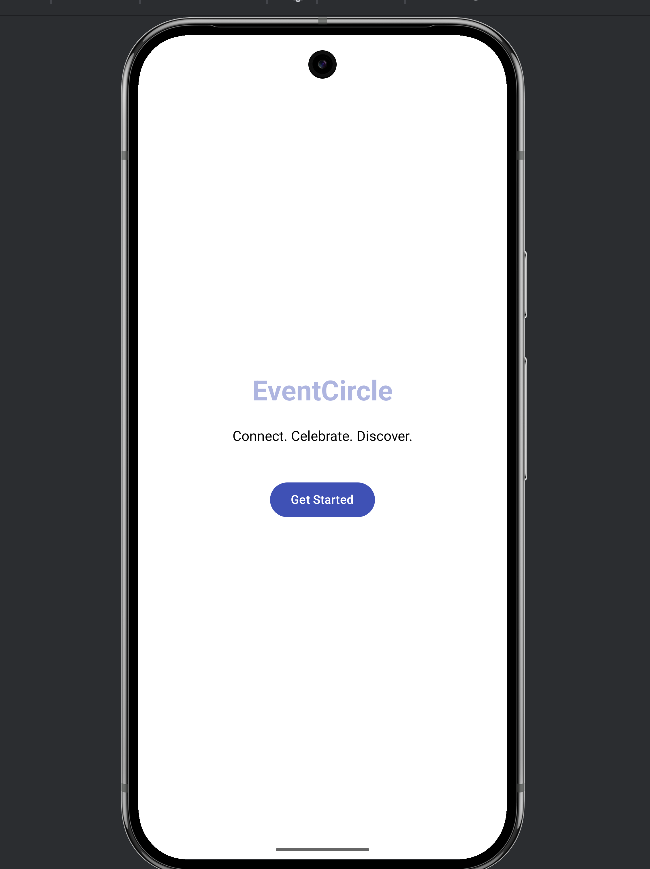
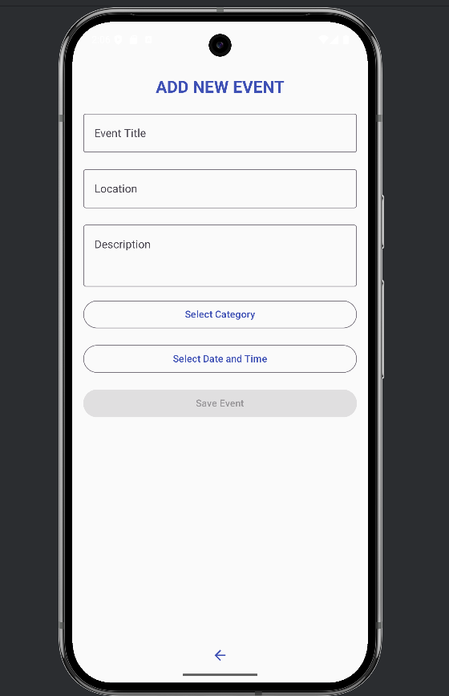
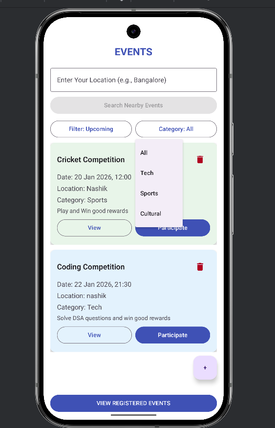

# 📱 EventCircle – Android Application

## 📌 Overview
**EventCircle** is an Android application built using **Kotlin** and **Android Studio** that allows users to **discover, create, and manage events** through a clean and user-friendly mobile interface.

This repository is structured so that **anyone can easily clone, set up, run, and contribute** to the project.

---

## 🎯 Problem Statement
Event information is often scattered across multiple platforms, making it difficult for users to track and manage events efficiently.  
EventCircle provides a **centralized mobile solution** for event discovery and management.

---

## 🚀 Features
- View list of events
- Create and manage events
- Simple and intuitive UI
- Clean Android project structure
- Easy navigation between screens

---

## 📸 App Screenshots

<p align="center">
  
  
  
</p>

> 📌 Note: Screenshots are provided to help users understand the UI without running the app.

---

## 🛠️ Tech Stack
- **Language:** Kotlin  
- **IDE:** Android Studio  
- **UI Design:** XML Layouts  
- **Build Tool:** Gradle (Kotlin DSL)  
- **Version Control:** Git & GitHub  

---

## 📂 Project Structure
``` 
EventCircle-Android/
├── app/                # Main application source code
├── gradle/             # Gradle wrapper files
├── screenshots/        # UI screenshots
├── build.gradle.kts    # Project-level build configuration
├── settings.gradle.kts # Project settings
├── gradlew             # Gradle wrapper script
├── .gitignore     

``` 
---

## ⚙️ How to Download & Run the Project

### ✅ Prerequisites
Make sure you have the following installed:
- Android Studio (latest version recommended)
- Java JDK 8 or above
- Git

---

### 📥 Step 1: Clone the Repository

Clone the project from below link and Run it on Android Studio
```bash
git clone https://github.com/wkirann/EventCircle.git
```

---

🤝 How to Contribute
Contributions are welcome! Follow these steps:

1️⃣ Fork the Repository
Click the Fork button on GitHub.

2️⃣ Clone Your Fork
```
git clone https://github.com/wkirann/EventCircle.git
```

3️⃣ Create a New Branch
```
git checkout -b feature/your-feature-name
```

4️⃣ Make Changes & Commit
```
git add .
git commit -m "Add: meaningful feature description"
```

5️⃣ Push Changes
```
git push origin feature/your-feature-name
```

### 6️⃣ Create a Pull Request
- Go to GitHub
- Click **New Pull Request**
- Describe your changes clearly

---

## 🧠 Contribution Guidelines
- Follow Kotlin and Android best practices
- Keep code clean and readable
- Test your changes before submitting
- Write clear and meaningful commit messages

---

## 👨‍💻 Author
**Kiran Wagh**  - Android & Full-Stack Development Enthusiast
